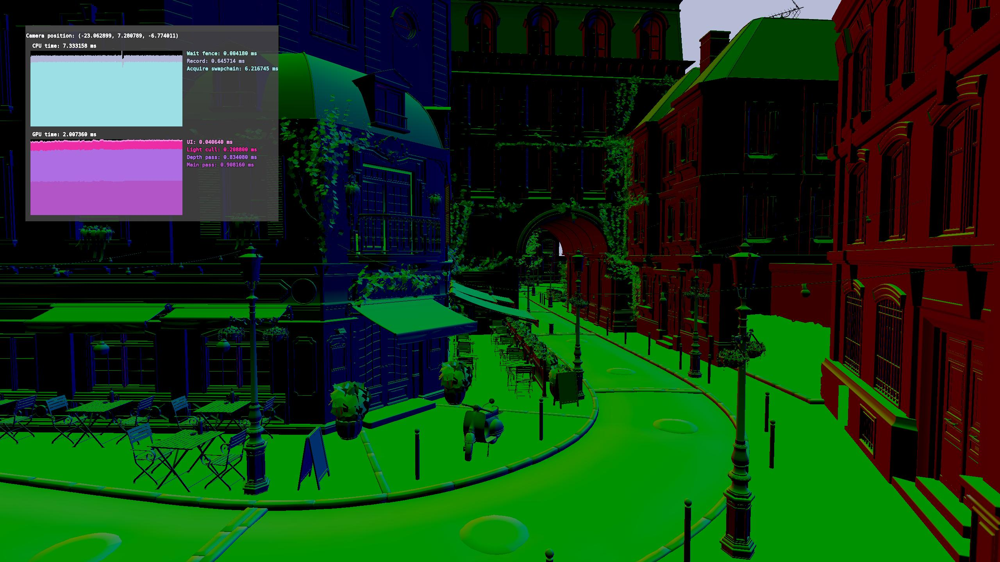

# vull

A vulkan rendering engine written in C++ 20.

## Features

* Render graph based vulkan abstraction
* Work-stealing coroutine job system
* Retained mode GUI
* Two-pass occlusion culling with hierarchical depth buffer
* Compressed pack file format
* Very WIP scripting and shading languages

## Dependencies

* [bc7enc_rdo](https://github.com/richgel999/bc7enc_rdo) (for vpak tool; vendored)
* [freetype](https://freetype.org)
* [harfbuzz](https://github.com/harfbuzz/harfbuzz)
* [libpng](https://github.com/glennrp/libpng) (for vpak tool)
* [meshoptimizer](https://github.com/zeux/meshoptimizer) (for vpak tool)
* [shaderc](https://github.com/google/shaderc) (for offline shader compilation step)
* [xcb](https://xcb.freedesktop.org)
* [xxHash](https://github.com/Cyan4973/xxHash)
* [zstd](https://github.com/facebook/zstd)

## Requirements

* Vulkan 1.3
* VK_EXT_descriptor_buffer
* VK_EXT_shader_atomic_float
* VK_EXT_shader_atomic_float2

## Building and running

Vull uses [cmake](https://cmake.org) as its build system. Either `make` or `ninja` will additionally be needed. Windows
is not currently supported. Alternatively, vull can be built in a reproducible docker environment
([see below](#building-in-docker)).

### Installing dependencies and tools

#### Gentoo

    emerge -n \
     app-arch/zstd \
     dev-libs/xxhash \
     dev-util/cmake \
     dev-util/ninja \
     media-libs/freetype \
     media-libs/harfbuzz \
     media-libs/libpng \
     media-libs/shaderc \
     media-libs/vulkan-layers \
     media-libs/vulkan-loader \
     x11-libs/libxcb \
     x11-libs/xcb-util

Note that `meshoptimizer` is always linked to via `FetchContent`, and that `bc7enc_rdo` is vendored. The vulkan
validation layers (`vulkan-layers`) are not required but are extremely useful for development and testing.

### Configuring CMake

To configure vull, use one of the available presets:

    cmake . --preset release-gcc -GNinja

#### Available presets

| Preset          | Description                     |
|-----------------|---------------------------------|
| `asan-clang`    | ASan and UBSan build with clang |
| `asan-gcc`      | ASan and UBSan build with gcc   |
| `debug-clang`   | Debug build with clang          |
| `debug-gcc`     | Debug build with gcc            |
| `release-clang` | Release build with clang        |
| `release-gcc`   | Release build with gcc          |
| `fuzz`          | Fuzz with AFLplusplus           |

#### Available options

| Option                    | Description                   | Default Value                           |
|---------------------------|-------------------------------|-----------------------------------------|
| `VULL_ENABLED_COMPONENTS` | List of components to build   | `graphics;physics;script;ui;x11-window` |
| `VULL_BUILD_VPAK`         | Build the vpak tool           | `ON`¹                                   |
| `VULL_BUILD_SANDBOX`      | Build the sandbox application | `PROJECT_IS_TOP_LEVEL`²                 |
| `VULL_BUILD_TESTS`        | Build tests                   | `PROJECT_IS_TOP_LEVEL`                  |

¹: Requires the `graphics` component to be enabled

²: Requires the vpak tool to be enabled, as well as the `graphics`, `physics`, `ui`, and `x11-window` components

### Building

    cmake --build build

### Running the tests

If `VULL_BUILD_TESTS` is enabled, tests can be run with

    cmake --build build --target test

## Building the documentation

If doxygen is available, documentation can be built with

    cmake --build build --target vull-docs

## Building in docker

    docker run --rm -u $(id -u) -v $(pwd):/src ghcr.io/yeetari/vull:master cmake \
     --preset release-gcc \
     -B/src/build \
     -GNinja \
     /src
    docker run --rm -u $(id -u) -v $(pwd):/src ghcr.io/yeetari/vull:master cmake --build /src/build

## Fuzzing

Vull has support for fuzzing with [AFLplusplus](https://github.com/AFLplusplus/AFLplusplus). Fuzz harnesses are located
in [tools/fuzz](tools/fuzz). To start fuzzing, use the `fuzz` cmake preset.

Input corpuses can be reduced with [tools/reduce_corpus.bash](tools/reduce_corpus.bash), as well as any found crashes.
A full workflow (using the script lexer fuzzer as an example) might look like:

    cmake --preset fuzz
    cd build-fuzz
    cmake --build .
    mkdir test-cases
    # Add some test cases
    ../tools/reduce_corpus.bash test-cases fuzz-corpus ./tools/fuzz/lexer-fuzz
    afl-fuzz -i fuzz-corpus -o fuzz-output -- ./tools/fuzz/lexer-fuzz

If any crashes are found, the crash directory can be reduced and inspected:

    ../tools/reduce_corpus.bash fuzz-output/default/crashes reduced-crashes ./tools/fuzz/lexer-fuzz
